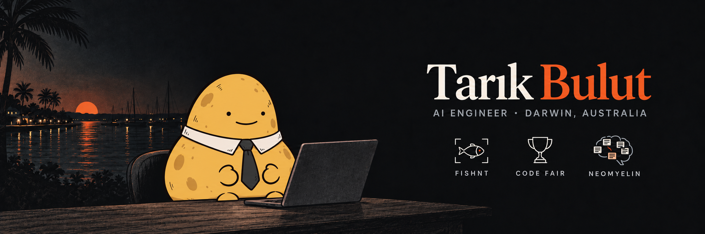

  

  <a href="https://github.com/Estaed/Estaed/blob/main/Tarik_Bulut_CV.pdf"><b>CV</b></a> &nbsp; / &nbsp;
  <a href="https://www.linkedin.com/in/tarikbulut/"><b>LinkedIn</b></a> &nbsp; / &nbsp;
  <a href="mailto:tarik.estaed@gmail.com"><b>Email</b></a>

 

Final-year **Master of IT (Artificial Intelligence)** at Charles Darwin University (November 2026), with a Software Engineering degree. I start from how a process actually runs, find where AI or an agent can help, build it, and test that it holds up in practice.

## Start here

<table>
  <tr>
    <td width="50%" valign="top">
      01 / SECOND BRAIN
      <h3><a href="https://github.com/Estaed/neomyelin">NeoMyelin</a></h3>
      
The memory I run my school, work and projects on, shipped empty. One message installs it into Claude Code, Codex or Antigravity.

      
<a href="https://github.com/Estaed/neomyelin"><b>Install your second brain →</b></a>

    </td>
    <td width="50%" valign="top">
      02 / COMPUTER VISION · THESIS
      <h3>FishNT</h3>
      
Built with NT Government Fisheries: detects, classifies and weighs fish on a processing line. <b>99.6%</b> accuracy, <b>0.63 cm</b> length error.

      
YOLO · SAM 2.1 · OpenCV · code private

    </td>
  </tr>
</table>

## CDU IT Code Fair 2026 · in progress

| Challenge | Entry |
| :--- | :--- |
| Data Innovation (DIC005) | [**Crosscheck**](https://github.com/Estaed/CDU_IT_CODEFAIR_DATA_2026): compares published connectivity claims for 96 remote NT communities and shows where to check first. [Open the live app →](https://estaed.github.io/CDU_IT_CODEFAIR_DATA_2026/) |
| AI Challenge (AIC014) | **Readmark**: helps a caseworker read a case file against NT policy, marking the pages that must be read and checking an AI summary against its sources. Code private. |
| Cyber Security | Live capture-the-flag, 29 October. |
| Coding & Poster, Research | Team entries built on FishNT, led by my teammates. |

## CDU IT Code Fair 2025 · Winner (AI), Runner-up (Data Science)

<table>
  <tr>
    <td width="50%" valign="top">
      WINNER · AI
      <h3><a href="https://github.com/Estaed/CDU_IT_CODEFAIR_Artifical_Intelligence">Kriol → English</a></h3>
      
End-to-end Kriol-to-English translation with NLLB-200, built from very limited data. Nominated for the NT Digital Excellence Awards 2025.

      
<a href="https://github.com/Estaed/CDU_IT_CODEFAIR_Artifical_Intelligence"><b>See the model →</b></a>

    </td>
    <td width="50%" valign="top">
      RUNNER-UP · DATA SCIENCE
      <h3><a href="https://github.com/Estaed/CDU_IT_CODEFAIR_Data_Science">Dark Sky NT</a></h3>
      
Stargazing tourism chatbot for non-technical users on RAG (FAISS) and a LoRA-tuned LLM, with multilingual BERT sentiment over reviews.

      
<a href="https://github.com/Estaed/CDU_IT_CODEFAIR_Data_Science"><b>See the chatbot →</b></a>

    </td>
  </tr>
</table>

## More to open

| Project | What to look for |
| :--- | :--- |
| [Connect4 AI](https://github.com/Estaed/Connet4_AI) | PPO self-play across 100 to 10,000 parallel games on a hybrid CPU-GPU setup. |
| [Taric AI Agent](https://github.com/Estaed/Taric_AI_Agent) | RL/IL support agent for League of Legends, with a [sim env](https://github.com/Estaed/Lol_Sim_Env) and an [MCP server](https://github.com/Estaed/Lol_Data_MCP_Server). Archived. |
| [Doom AI](https://github.com/Estaed/Doom-AI) · [Mario AI](https://github.com/Estaed/Mario-AI) | DQN vs PPO on an FPS and a platformer. |

## Open source

I run my work through Claude Code, Codex and a Hermes agent sharing one memory. Merged contributions to [avenoxbeyin](https://github.com/avenoxai/avenoxbeyin), the second brain NeoMyelin grew from:

| PR | Change |
| :--- | :--- |
| [#77](https://github.com/avenoxai/avenoxbeyin/pull/77) | install: keep a customised legacy runner next to V3 |
| [#93](https://github.com/avenoxai/avenoxbeyin/pull/93) | hooks: skip flag for delegated agent runs |
| [#95](https://github.com/avenoxai/avenoxbeyin/pull/95) | hooks: remind once at Stop when edits have no receipt |
| [#103](https://github.com/avenoxai/avenoxbeyin/pull/103) | doctor: report dead in-vault links |
| [#169](https://github.com/avenoxai/avenoxbeyin/pull/169) | tests: isolate the suite from inherited agent flags |
| [avenoxskills#4](https://github.com/avenoxai/avenoxskills/pull/4) | quota-limit skill for Claude Code and Codex |

## Toolbox

**AI:** LLM agents, multi-agent workflows, RAG, MCP, LoRA, computer vision, NLP, RL (PPO, DQN) 
**Platforms:** Azure (VMs, Logic Apps), Docker, GitHub, DigitalOcean, Firebase 
**Languages:** Python, SQL, Java, C#, Dart

 

---

  <b>Map the process. Build. Test. Ship.</b> 
  EU4 Aztec fan and LoL Taric main

